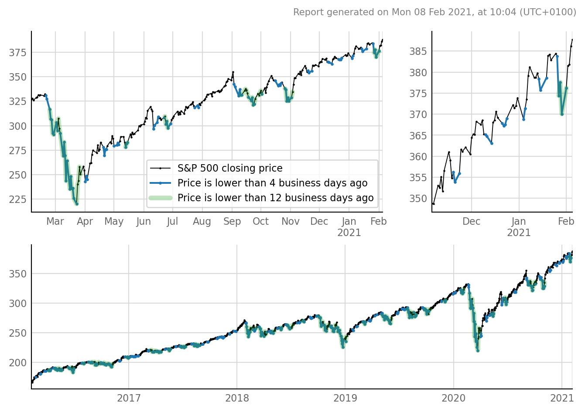

# When to buy SPY

You've got some money to invest in the next month or so.
When to buy (when's the dip)?

This script generates a plot like the following:

..and places it on your Desktop.

## Requirements

- [`yfinance`](https://github.com/ranaroussi/yfinance),
  which parses the [Yahoo Finance API](https://query1.finance.yahoo.com/v7/finance/options/SPY)
  to [Pandas](https://pandas.pydata.org/) DataFrames.
- [`tfiers`](https://github.com/tfiers/tfiers-py),
  for plot styling.

Both are `pip`-installable.

## More info

The `.py` file is synched with the `.ipynb` file through
[jupytext](https://github.com/mwouts/jupytext).

To automatically run the script every day on Windows,
use Task Scheduler.
  - 'Action' is 'Start a program', namely your `python.exe`.
    - With argument: the path to this repo's `when_to_buy_sp500.py`.
  - To not have a command windows pop up when the script is
    running, check "Run whether the user is logged in or not".
    - "Do not store password" may be checked.
    - Using `pythonw.exe` (for 'windowless')
      instead of `python.exe` does not work.
